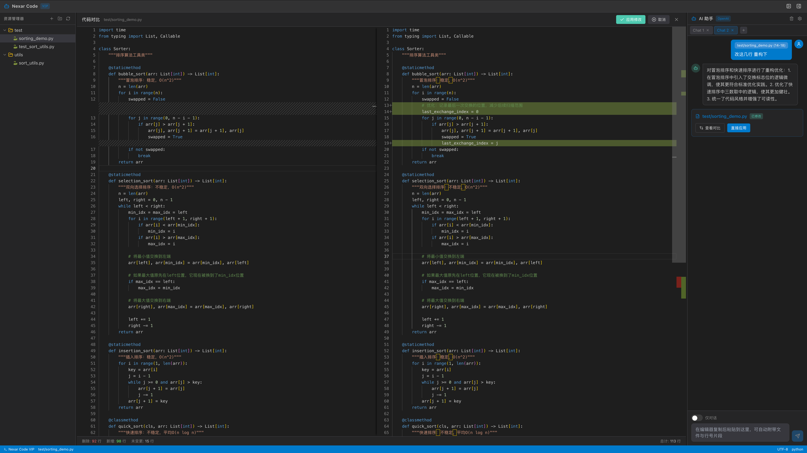

# Nexar Code ⬛️: 为极客打造的白盒 AI 编程助手

🚧 **1.0 版本目前正在开发中。**

[English](./README.md) / 简体中文

天下苦 AI 的“黑盒魔法”久矣！你是否厌倦了主流 AI 编程工具把你当成小白？厌倦了它们在后台偷偷拼接你无法干预的系统提示词（System Prompts），并给出莫名其妙的代码？

**Nexar** 为此而生。它不是一个包办一切的“傻瓜式”助手，而是一个**完全透明、深度可定制的白盒 AI 引擎**。在 Nexar 的世界里，你才是真正的架构师，而 AI 只是严守你规则的执行器。

## 🎯 核心理念：拒绝黑盒，把方向盘交还给极客

Nexar v1.0 Alpha 围绕着三个最核心的开发者诉求打造：

- 👁️ **全白盒可见 (可感)：** 没有任何隐藏的魔法。Nexar 会把每一次请求发送给大模型前拼接好的完整 Prompt（包括抓取了哪些代码切片、附加了什么上下文日志）完完整整地展示给你看。返回的原始数据流同样全程可见。
- ⚙️ **深度可定制 (可调)：** 所有的 AI 行为模式都可以通过自定义的 XML 标签框架进行编程。你可以在项目根目录下创建 `.nexarprompts/` 目录，精准定义 AI 的思考链路和约束。例如，你可以通过提示词模板严格要求 AI 在计算内存占用时满足特定的数学渐进上限 $\sum_{i=1}^{n} \log(i) \approx n \log n$。
- ⚖️ **全方位掌控 (可控)：** 完美平衡 速度、效果 与 成本 的“不可能三角”。
  - **按需路由**：极其简单的排错发给本地免费的开源大模型（如 Ollama），极度复杂的重构抛给云端的顶配模型（如 Claude 或 OpenAI）。
  - **自带密钥 (BYOK)**：我们不搞强制的月租订阅。填入你自己的 API Key，用多少算多少，把每一分钱和每一滴算力都花在刀刃上。

## 📦 快速安装

当前版本为核心功能体验版，请在本地构建并安装：

参考：[Install](./install.md)

## 🗺 发展路线图与高级功能

<b>点击展开查看 VIP 进阶版及 V1.0 规划</b>

V1.0 版本我们致力于打磨最基础的“白盒与掌控权”。在后续的迭代及高级版本中，我们将探索并引入：

- **UNIX 哲学工作流 (AI-Piping)**：允许你在命令面板中使用管道符 `|`，将 AI 的输出无缝传递给本地的代码格式化工具（Linter/Formatter）或测试脚本。
- **沙盒安全推演 (Sandbox Dry-Run)**：拦截 AI 生成的危险终端命令，将其放入隔离的本地容器中试运行，确保无破坏性后再应用于真实终端。
- **隐式知识图谱关联**：为复杂的遗留项目生成可视化的图谱，极客可以手动在图谱上“连线”，强制告诉 AI 特定文件之间的隐式业务联系。

## 🤝 参与贡献

我们欢迎所有极客、开源爱好者提交 Pull Request，一起打造真正属于开发者的 AI 兵器。

## 📄 开源协议

本项目基于 [MIT 协议](LICENSE) 进行开源。
