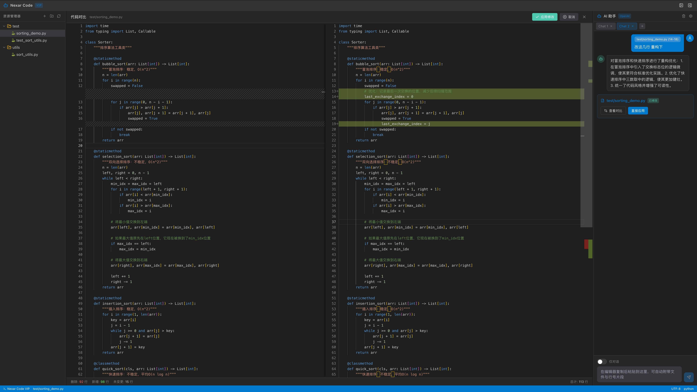

# Nexar Code

一个面向开发者的白盒 AI 编程助手（前后端分离）。

[English](./README.md) / 简体中文



## 项目状态

- 当前阶段：`v1.0 Alpha`
- 更新时间：`2026-03-04`
- 说明：项目还在持续优化中，重点在稳定性、可控性和执行链路透明度。

## 这个版本已经能做什么

基于当前代码，主要能力如下：

- 文件工作区管理：读取目录树、读写文件、新建、删除、重命名。
- 工作区切换：前端可切换后端使用的 `workspace_root`。
- AI 多模型接入：支持 `OpenAI`、`Claude`、`Custom(OpenAI 兼容)`。
- 闭环执行模式：`规划 -> 动作执行 -> 继续规划`，支持运行状态查询。
- 可中断控制：支持 `pause / resume / cancel`。
- 终端会话：创建终端、写入输入、拉取输出、调整窗口、关闭会话。
- 前端开发界面：文件树 + 编辑器 + Chat + Diff + Terminal。

## 架构概览

- 前端：`React + TypeScript + Vite + Monaco + xterm`
- 后端：`FastAPI + Pydantic`
- 关键路由：
  - `/api/files/*` 文件与工作区
  - `/api/ai/*` 模型调用与 run 状态机
  - `/api/terminal/*` 终端会话管理

## 快速启动

### 1) 启动后端

```bash
cd backend
python -m venv .venv
source .venv/bin/activate  # Windows: .venv\Scripts\activate
pip install -r requirements.txt
cp .env.example .env
```

编辑 `backend/.env`，至少填一个模型配置（如 `OPENAI_API_KEY`）。

回到仓库根目录启动：

```bash
cd ..
uvicorn backend.main:app --reload --host 0.0.0.0 --port 8000
```

### 2) 启动前端

```bash
cd frontend
npm install
npm run dev
```

默认访问：`http://localhost:3000`（已代理 `/api` 到 `http://localhost:8000`）。

## 环境变量（后端）

参考 `backend/.env.example`：

- `OPENAI_API_KEY` / `OPENAI_BASE_URL` / `OPENAI_MODEL`
- `ANTHROPIC_API_KEY` / `ANTHROPIC_MODEL`
- `CUSTOM_API_KEY` / `CUSTOM_BASE_URL` / `CUSTOM_MODEL`
- `WORKSPACE_ROOT`

## 当前重点优化方向

下面这些是正在持续推进的方向：

- Planner 指令稳定性和动作质量（减少无效动作、减少回退）。
- 长会话上下文管理（历史压缩和 token 成本控制）。
- 终端与文件操作的错误回传质量（更易排查）。
- 前端设置页能力补全（当前部分 Tab 仍是占位）。
- 文档和示例持续对齐代码，减少“文档超前/滞后”。

## 已知边界

- 当前是 Alpha，接口和数据结构仍可能调整。
- 默认没有完整自动化测试矩阵，回归主要依赖手工验证。
- 安装/初始化类命令在闭环执行中会被策略性跳过，避免误操作环境。

## 贡献

欢迎提 Issue / PR。建议附上：

- 复现步骤
- 预期结果与实际结果
- 关键日志（后端 `logs/`）

## License

MIT
